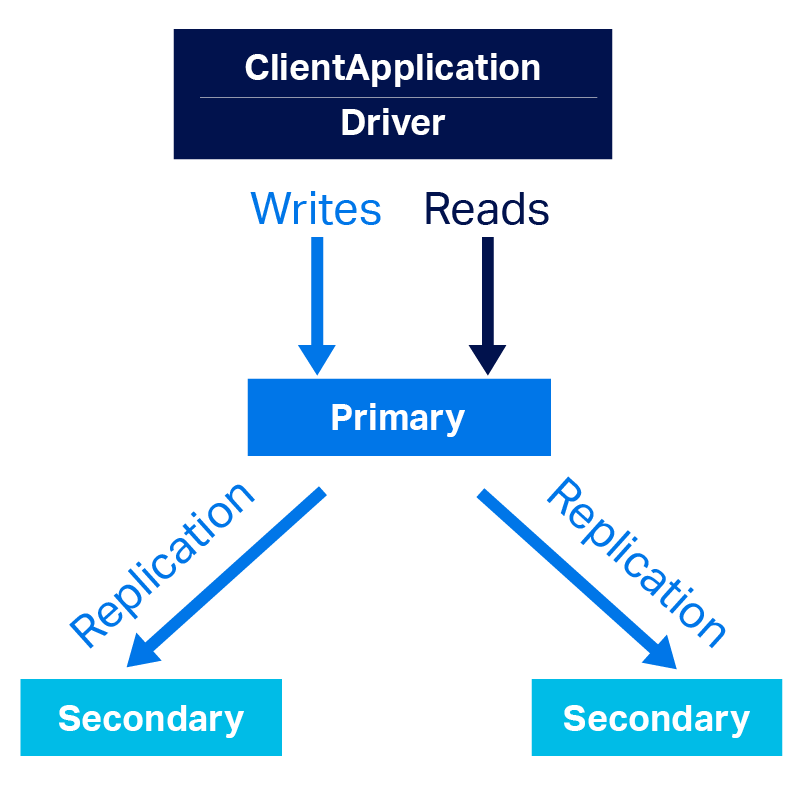
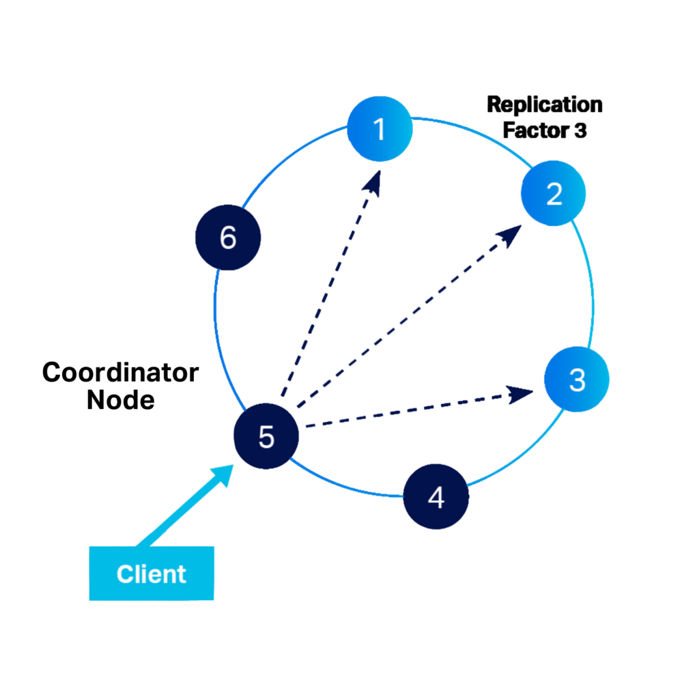

## MongoDB

Относится к **CP**-системе, за счет архитектуры "несколько реплик - один первичный узел". Все чтение происходит из главного узла, реплики получают актуальные данные. 

  

[MongoDB Replication](https://www.mongodb.com/docs/manual/replication/)

Если основной узел выходит из строя, в качестве основного узла будет выбран новый узел, тем самым наборы реплик помогают достигнуть устойчивость к распределению (**P**). 

Пока происходит выбор нового лидера, данные никак не могут быть прочитаны/перезаписаны, за счет чего достигается консистеность данных (**C**).

Когда основной узел становится недоступен, пользователь не может соответветсвенно читать/записывать данные, что исключает признак доступности (**not A**)

Однако есть возможность “read-preference”, которая позволяет клиентам напрямую читать (но не записывать) со вторичного узла. В отсутствии лидера, реплики не смогут получать последние данные, поэтому не будет достигаться согласованность (**not C**).

[MongoDB Read preferences](https://www.mongodb.com/docs/manual/core/read-preference/)

  

Эта фича позволяет MongoDB также может относится к **AP**-системами.

## Microsoft SQL Server

Зависит от того, сколько узлов мы используем:

* 1 узел - **CA**, т.к. база данных всегда консистента и напрямую отвечает пользователю на запросы, если работоспособна

* N узлов - при включенной настройке <em>AlwaysOn</em> работает в режиме **AP**, иначе **CP** 

## Cassandra

Относится к **AP**-системе, за счет кольцевой архитектуры - главного узла нет, и каждый узел может выполнять все операции с базой данных, обрабатывая запросы клиентов. Данные распределяются по узлам на основе ключа партиции.

Данные имеют коэффициент репликации, который определяет количество копий, которые должны быть сделаны. Реплики автоматически сохраняются на разных узлах.

Предположим что "replication factor" = 3. Если один узел получил данные и успешно передал данные двум другим узлам - такая база данных считается консистентной.

Однако если по какой-либо причине третья реплика не получила обновленную копию данных (задержка сети, потеря пакета), то при прочтении данных с данного узла возникнет неконсистентность (**not C**).

  

