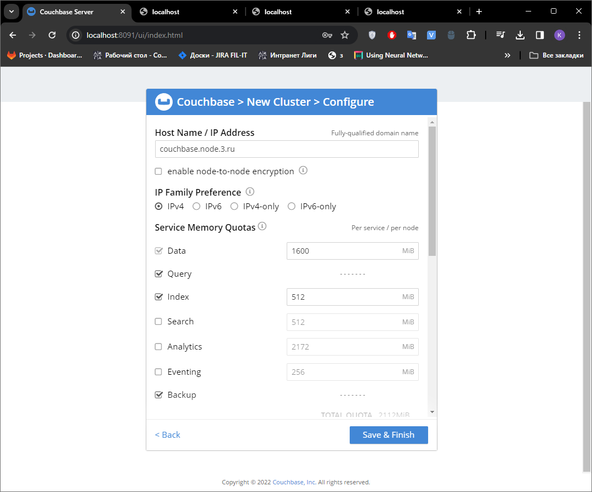
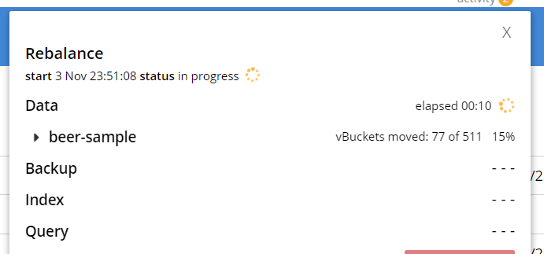

## Подготовка к запуску

За основу был взят docker-compose взятый со следующего [сайта](https://coderlessons.com/articles/devops-articles/couchbase-cluster-s-pomoshchiu-docker-compose).

Отличие заключается в отключеном монтировании для нод - так как информация о БД сохранялось на хост-машине, даже при изменении конфигурации в docker файле, подтягивались прежние настройки, что вынуждало вручную чистить директории на хост-машине. Плюс каждой ноде добавлен hostname , для удобства и корректной работы при добавлении нод в кластер через веб-интерфейс (след. пункт).

#### **`docker-compose.yml`**

```yml
version: '3.7'

services:
  couchbase1:
    image: couchbase/server:latest
      # volumes:
    #- ~/couchbase/node1:/opt/couchbase/var
    hostname: couchbase.node.1.ru
  couchbase2:
    image: couchbase/server:latest
      # volumes:
    # - ~/couchbase/node2:/opt/couchbase/var
    hostname: couchbase.node.2.ru
  couchbase3:
    image: couchbase/server:latest
      # volumes:
    # - ~/couchbase/node3:/opt/couchbase/var
    ports:
      - 8091:8091
      - 8092:8092
      - 8093:8093
      - 11210:11210
    hostname: couchbase.node.3.ru
  couchbase4:
    image: couchbase/server:latest
      # volumes:
    # - ~/couchbase/node4:/opt/couchbase/var
    hostname: couchbase.node.4.ru
```

В соответствии с [документацией](https://docs.couchbase.com/server/current/install/install-ports.html#detailed-port-description), порты были открыты для:
1. 8091 - Веб-интерфейс
2. 8092 - Views and XDCR
3. 8093 - Query service
4. 11210 - Data service

<span style="color:gray">
(Уточнить зачем открывать что-то кроме 8091 порта, когда все взаимодействие в рамках задания заключено вокруг веб-интерфейса)
</span>

## Создание кластера

Добавим ноды в кластер по их hostname, получив 3 ноды в кластере всего



После ребалансировки добавим тестовый датасет beer-sample и посмотрим как он распределился между нодами.


После добавления еще одной ноды и ребалансировки, средний хранимый размер данных на каждую ноду соответственно изменится, за счет перемещения "частей бакета" на новую ноду.




После ручного "жесткого" failover двух нод, опытном путем было обнаружено, что после перебалансировки выжившие ноды стали хранить больше данных на жестком диске и меньше в RAM.

