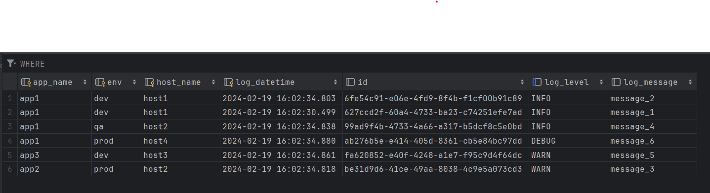
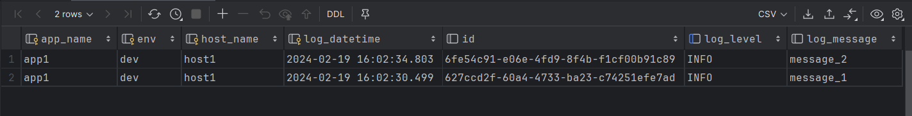
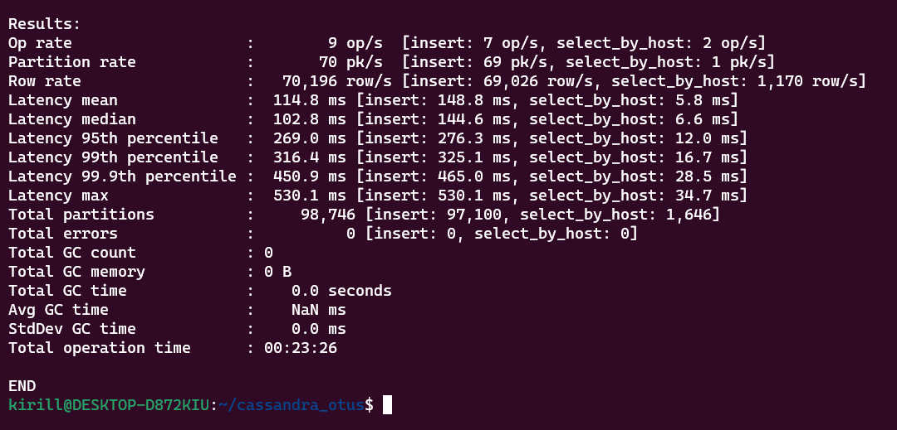
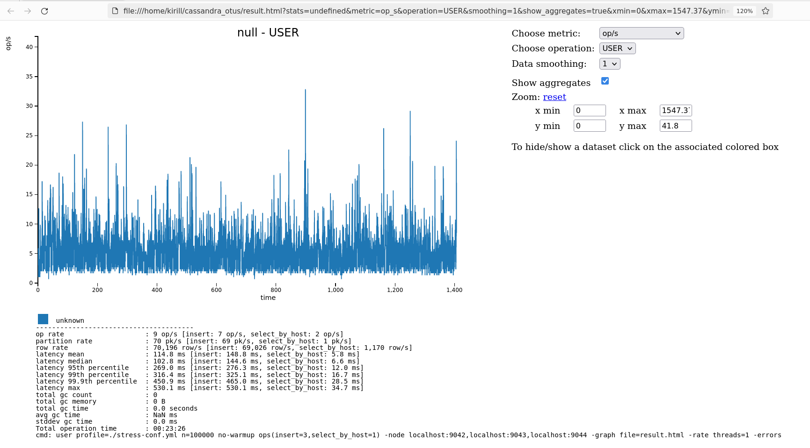

## Запуска кластера через docker-compose

#### **`docker-compose.yml`**

```yml
version: "3.3"

services:

  cassandra1:
    image: cassandra:latest
    ports:
      - "9042:9042"
      - "9160:9160"
      - "7199:7199"
    volumes:
      - "cassandra_data_seed:/var/lib/cassandra"
    environment:
      - "CASSANDRA_SEEDS=cassandra1,cassandra2,cassandra3"
      - "CASSANDRA_CLUSTER_NAME=Test"
      - "CASSANDRA_DC=eu-central-2"
      # - "CASSANDRA_ENDPOINT_SNITCH=GossipingPropertyFileSnitch"
    restart: always

  cassandra2:
    image: cassandra:latest
    ports:
      - "9043:9042"
    volumes:
      - "cassandra_data_1:/var/lib/cassandra"
    environment:
      - "CASSANDRA_SEEDS=cassandra1,cassandra2,cassandra3"
      - "CASSANDRA_CLUSTER_NAME=Test"
      - "CASSANDRA_DC=eu-central-2"
      # - "CASSANDRA_ENDPOINT_SNITCH=GossipingPropertyFileSnitch"

  cassandra3:
    image: cassandra:latest
    ports:
      - "9044:9042"
    volumes:
      - "cassandra_data_2:/var/lib/cassandra"
    environment:
      - "CASSANDRA_SEEDS=cassandra1,cassandra2,cassandra3"
      - "CASSANDRA_CLUSTER_NAME=Test"
      - "CASSANDRA_DC=eu-central-2"
      # - "CASSANDRA_ENDPOINT_SNITCH=GossipingPropertyFileSnitch"
    restart: always

volumes:
  cassandra_data_1:
  cassandra_data_2:
  cassandra_data_3:
```

Прописан проброс портов (помимо порта для работы с CQL, указан *JMX порт, который понадобится позже), с
помощью [seeds](https://cassandra.apache.org/doc/stable/cassandra/getting_started/configuring.html) указаны IP-адреса
для создания кластер, дано наименование кластера

## Работа c CQL

Работа велась через DataGrip

```cassandraql
-- Create keyspace
CREATE KEYSPACE IF NOT EXISTS test_keyspace WITH REPLICATION = {
    'class': 'SimpleStrategy', 'replication_factor': 2
    };

-- Create tables
CREATE TABLE IF NOT EXISTS test_keyspace.first_table
(
    id           UUID,
    app_name     VARCHAR,
    env          VARCHAR,
    host_name    VARCHAR,
    log_datetime TIMESTAMP,
    log_message  TEXT,
    log_level    VARCHAR,
    PRIMARY KEY ((app_name, env), host_name, log_datetime)
)
            WITH CLUSTERING ORDER BY (host_name ASC, log_datetime DESC);

CREATE TABLE IF NOT EXISTS test_keyspace.second_table
(
    id           UUID,
    app_name     VARCHAR,
    env          VARCHAR,
    host_name    VARCHAR,
    log_datetime TIMESTAMP,
    log_message  TEXT,
    log_level    VARCHAR,
    PRIMARY KEY (id)
);

-- Add index to first table
CREATE INDEX log_level_idx ON test_keyspace.first_table (log_level);
```

После вставки опр. количества данных были простетированы WHERE запросы


Запрос по ключу работает успешно

```cassandraql
SELECT *
FROM test_keyspace.first_table
WHERE app_name = 'app1'
  AND env = 'dev';
```



```cassandraql
SELECT *
FROM test_keyspace.first_table
WHERE log_level = 'INFO';
```

Запрос отработал без ошибок/предупреждений, за счет того, что поиск шел по индексированному полю

```cassandraql
SELECT *
FROM test_keyspace.first_table
WHERE host_name = 'host2' ALLOW FILTERING;
```

Следующий запрос, за счет того, что не включает фильтрацию по ключу
(т.е план запроса будет заключаться в прохождении всех записей), без **ALLOW FILTERING** выдает ошибку

**Cannot execute this query as it might involve data filtering and thus may have unpredictable performance.If you want to execute this query despite the performance unpredictability, use ALLOW FILTERING**

## Стресс-тестирование

Создана yml конфигурация, с описанием как генерировать и в каком количество данные

```yaml
specname: test1

keyspace: test_keyspace
table: first_table

# Спецификация данных для каждой колонки
columnspec:
  - name: app_name
    # Наименование в пределах 5-10 символов
    size: uniform(5..10)
    # 30 возможных поднятых приложений на выбор
    population: uniform(1..30)
  - name: env
    size: uniform(3..6) # Наименование стенда обычно короткое (dev, prod)
    population: gaussian(1..10) # Макс. кол-во стендов
  - name: hostname
    cluster: gaussian(5..10) # Будем считать что хост выражен в виде DNS имени
  - name: log_datetime
    cluster: fixed(1000) # Макс кол-во заходов пользователя
  - name: log_message
    size: gaussian(100..500) # Сообщение может быть длинным
  - name: log_level
    size: fixed(8) # Check log4j levels


insert:
  # Используем от 1 до 20 партиций каждый batch
  partitions: uniform(1..20)
  # Не использовать batch log
  batchtype: UNLOGGED

queries:
  select_by_host:
    cql: select * from first_table where app_name = ? and env = ? and host_name = ?
    fields: samerow
```

Для вызова утилиты пришлось установить пакет cassandra на хост машину

```shell
./apache-cassandra-5.0-beta1/tools/bin/cassandra-stress user profile=./stress-conf.yml n=100000 no-warmup ops(
insert=3,select_by_host=1) -node localhost:9042,localhost:9043,localhost:9044 -graph file=result.html -rate threads=1
-errors
```

Прописан файл куда необходимости вывести результат, кол-во потоков, "разогревать/нет" ли VM, отношение между insert и
queries блоком (*здесь понадобился JMX порт который выдает данные о "загрузке"")



