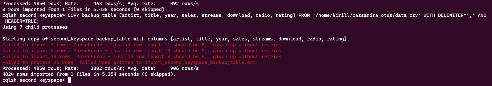
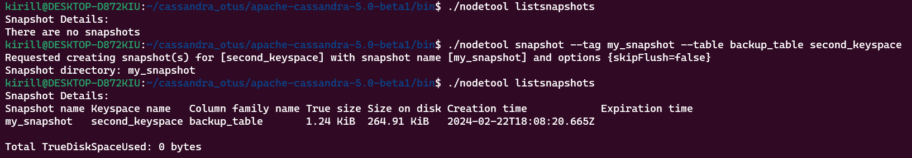
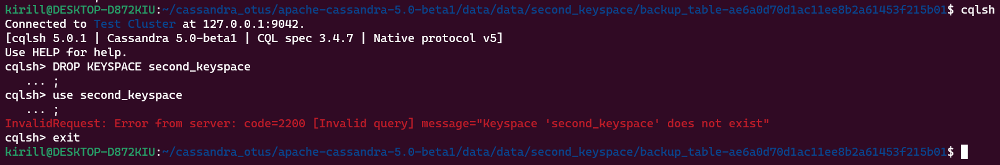
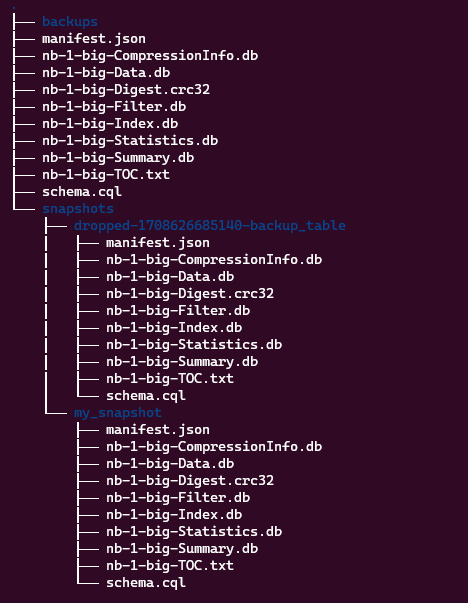
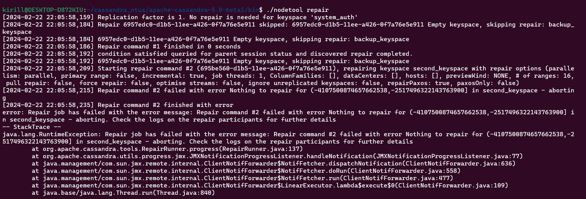
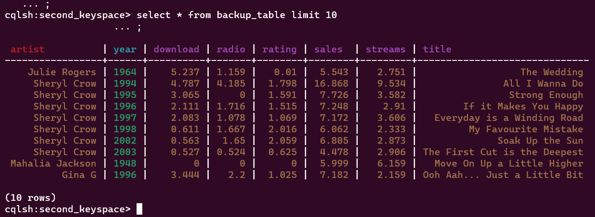

## Подготовка данных

Для того, чтобы протестировать как будет работать backup на данных больше, 
чем пару строк, было решено загрузить [тестовый датасет](https://www.kaggle.com/datasets/shiivvvaam/top-songs-of-the-world) в базу

Для этого была использован `COPY`

```cassandraql
COPY backup_table (...) FROM '...data.csv' WITH DELIMITER=',' AND HEADER=TRUE;
```

Произошел (почти) успешный импорт данных



## Создание snapshot'a

Для создания snapshot'a необходимо утилита `nodetool snapshot`

```shell
./nodetool snapshot --tag my_snapshot --table backup_table second_keyspace
```

`--tag` - создает директорию с необходимым наименованием для более быстрого поиска бекапа среди директорий, которые будут упомянуты ниже



С помощью `nodetool listnapshots` можно удостовериться что бекап действительно лежит на диске

### Структура директорий

Структура директорий имеет следующий вид 

`data/data/<KEYSPACE>/<TABLE-UUID>/snapshots/<SNAPSHOT>`

В нашем случае путь до только что созданного snap будет следующим:

`data/data/second_keyspace/backup_table-ae6a0d70d1ac11ee8b2a61453f215b01/snapshots/my_snapshot`

## Восстановление из snapshot'a

Дропнем наш keyspace и его таблицы соответственно, а затем для удобства создадим keyspace с таким же именем еще раз



Snapshot не хранит в себе информацию о DDL (т.е структуре таблицы), 
а значит необходимо вручную создать таблицу соответсвующую структуре той которая изначально бекапнута

Сделать это можно с помощью ``schema.cql`` который есть у каждого snapshot'a

```shell
cqlsh -f schema.cql
```

```text
second_keyspace> SELECT *
                 FROM second_keyspace.backup_table
                 LIMIT 501
[2024-02-22 21:46:46] 0 rows retrieved in 71 ms (execution: 8 ms, fetching: 63 ms)
```
Таблица восстановлена, теперь необходимо вернуть данные. По [инструкции](https://docs.datastax.com/en/cassandra-oss/2.1/cassandra/operations/ops_backup_snapshot_restore_t.html)
необходимо перенести данные из директории snapshot'a в data/<KEYSPACE>/<TABLE-UUID>

Из директории вызываем, должно получиться следующее:

```shell
cp -R snapshots/my_snapshot/. .
```



Дальше необходимо отключить ноду и сделать рестарт:

```shell
./nodetool drain
./nodetool stopdaemon

./cassandra
```

После перезапуска, некоторые источники советуют совершить ```nodetool repair```, но он не принес каких-то результатов



Это в целом неважно, ведь наши данные на своем месте

