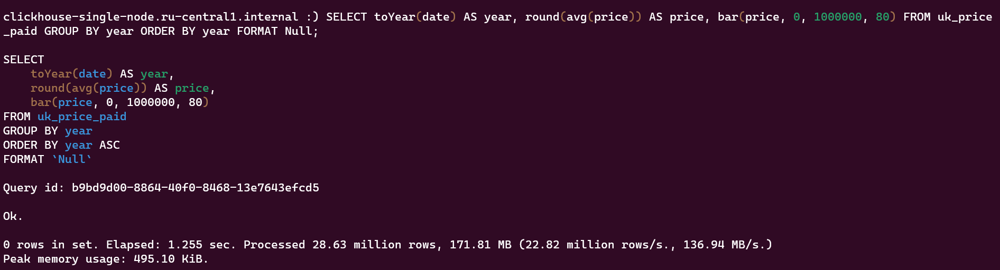

## Подготовка к запуску

Для запуска single-node варианта Clickhouse было выбрано поднять ВМ с помощью Yandex.Cloud.

Был взят последний Ubuntu (22.04), на борту 10 GB SSD/8 GB RAM. Для подключения настроены SSH-ключи.

## Подготовка Single-node БД

В соответствии с [туториалом](https://clickhouse.com/docs/ru/getting-started/install) был поднят сервер Clickhouse. Для
начала нужно было создать нового **admin** пользователя и дать ему все права.

<details>

<summary>Проблемы с RBAC, с которыми пришлось столкнуться</summary>

При первом входе в систему, с **default** пользователя, оказалось что у него нет никаких прав на создание новых
пользователей впринципе, хотя команда ```SHOW GRANTS``` утверждала обратное.

<figure>
    
    <figcaption>Запрет на создание нового пользователя</figcaption>
</figure>

<figure>
    
    <figcaption>Права по умолчанию для default</figcaption>
</figure>

Первая, крайне неочевидная для чайника, проблема в том - что в по умолчанию в конфигурационном файле **users.xml**
параметр ```access_management``` по умолчанию отключен (<span style="color:gray">зачем?</span>), что не дает
использовать
SQL-ориентированный RBAC ([см. тут](https://clickhouse.com/docs/ru/operations/access-rights#enabling-access-control)).

После этого команда ```CREATE USER``` заработала.

<figure>
    
    <figcaption>Отображение списка пользователей</figcaption>
</figure>

Вторая проблема заключалась, что с **default** пользователя нельзя было дать права/роль другим
пользователя (<span style="color:gray">аналогично неочевидно</span>), пока не был изменен пароль по умолчаниию
через ```/etc/clickhouse-server/users.d/default-password.xml``` и перезагружен сервер.

<figure>
    
    <figcaption>Выдача админу прав админа</figcaption>
</figure>

</details>

### Импорт данных

В соответствии с [туториалом](https://clickhouse.com/docs/ru/getting-started/example-datasets/uk-price-paid) был импортирован тестовый датасет.

<figure>
    
    <figcaption>Cоздание таблицы</figcaption>
</figure>

<figure>
    
    <figcaption>Импорт датасета</figcaption>
</figure>

* Опытным путем было обнаружено, что ```clickhouse-local``` не умеет в переменные в качестве данных для флагов, то есть вынести текст команды, например, в отдельные файлы для структуру/запроса и вызвать через ```$(< file.txt)``` нельзя

Команды протестированы - чтобы не выводить сами данные, если интересует только скорость - можно добавить в конце строчку ```FORMAT NULL```

<figure>
    
    <figcaption>Запрос 1</figcaption>
</figure>

<figure>
    
    <figcaption>Запрос 2</figcaption>
</figure>


