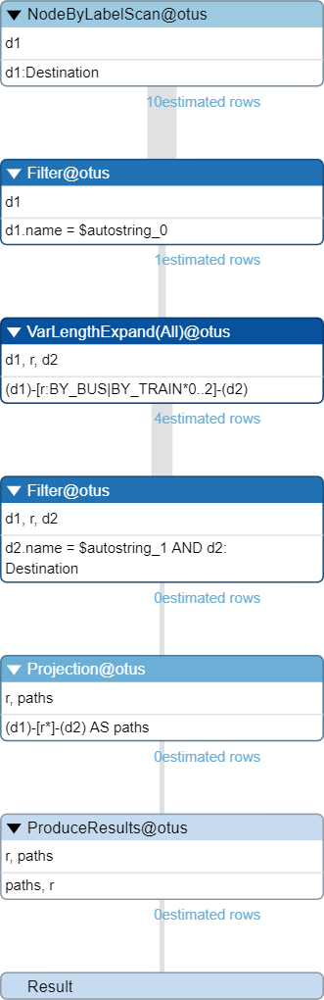

### Подготовка к запуску

Был скачана актуальная Windows версия Neo4j.

### Заполнение данными

**`Создание отношения между городом и страной`**

```sql
MATCH
    (a:Destination {name : 'Неаполь'})
    ,(b:Country {name : 'Италия'})
CREATE
    (a)
    -[r:PART_OF] -> (b)
```

**`Создание направления с указанием типа между городами`**

```sql
MATCH
    (a:Destination {name : 'Неаполь'})
    ,(b:Destination {name : 'Рим'})
CREATE
    (b)
    -[r:BY_TRAIN {isOverland: true}] -> (a)
```

**`Создание ноды города`**

```sql
CREATE
    (:Destination {name : 'Неаполь'})
```

По итогу был создан следующий граф описывающий перемещения по Италии


### Запрос на нахождение всех возможных путей между А и Б

Так как отношения касающиеся передвижения из города в город имеют аттрибут `isOverland`,
который говорит является ли путь наземным мы можем искать маршруты несколькими способами:

**`По аттрибуту`**

```sql
MATCH paths=(d1:Destination {name:'Рим'})-[r*0..2 {isOverland: true}]-(d2:Destination {name: 'Неаполь'}) RETURN paths, r
```

**`По конкретному типу отношения`**

```sql
MATCH paths=(d1:Destination {name:'Рим'})-[r:BY_BUS|BY_TRAIN*0..2]-(d2:Destination {name: 'Неаполь'}) return paths, r
```

Оба запроса дают один и тот же результат

**`Граф передвижений`**


**`Таблица маршрутов`**


### Сравнение планов запросов

<details>
  <summary>Посмотреть содержимое</summary>

На каждый запрос указанный выше был получен план через ``EXPLAIN MATCH`` и ``PROFILE MATCH``

|      EXPLAIN по аттрибуту      | EXPLAIN по конкретному типу отношения |
|:------------------------------:|:-------------------------------------:|
|  |    |

|      PROFILE по аттрибуту      | PROFILE по конкретному типу отношения |
|:------------------------------:|:-------------------------------------:|
|  |    |

</details>

### Добавление индекса и сравнения производительности

Добавим индекс на наименование города

```sql
CREATE INDEX city_name_index FOR (d:Destination) ON (d.name)
```

Так как в документации указано что индексы создаются не сразу, а запускают сторонний процес, проверим все ли на месте
через ``SHOW INDEX``


Используя синтаксис ``USING INDEX`` сравним планы запросов с индексацией и без

```sql
PROFILE 
MATCH paths=(d1:Destination {name:'Рим'})-[r*0..2 {isOverland: true}]-(d2:Destination {name: 'Неаполь'}) 
USING INDEX d2:Destination(name) 
USING INDEX d1:Destination(name) 
RETURN paths, r
```

|     С индексом     |      Без индекса      |
|:------------------:|:---------------------:|
|  |  |

Итог:
1) Уменьшилась выборка 
2) Уменьшилось кол-во обращений к БД (hits)
3) Уменьшилось потребление памяти