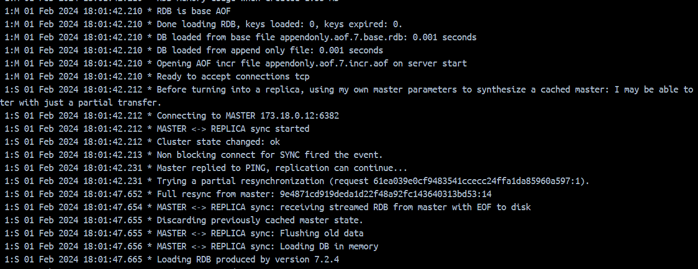

## Запуск single-node

Для запуска single-node достаточно установить redis в дистрибутив.\
После установки (конфигурация не менялась) можно зайти через redis-cli (хост опционален).

```shell
redis-cli -h 127.0.0.1 -p 6379
```

### Python-скрипт для тестирования чтения/записи

С помощью py-redis был написаны скрипты для загрузки json, и сохранения его построчно в разные структуры данных

#### **`main.py`**

```python
from redis.cluster import Redis
from datetime import datetime
import json

node = Redis(host="127.0.0.1", port=6379, decode_responses=True)


def set_json():
    start_time = datetime.now()
    with open('large-file.json', 'r', encoding="utf-8") as json_file:
        pipe = node.pipeline()
        data = json.loads(json_file.read())
        for index, item in enumerate(data):
            key = f'key-{index}'
            pipe.set(key, str(item))
        pipe.execute()

    print("evaluation time: {}".format(datetime.now() - start_time))


def set_hash_set():
    start_time = datetime.now()
    with open('large-file.json', 'r', encoding="utf-8") as json_file:
        pipe = node.pipeline()
        data = json.loads(json_file.read())
        for index, item in enumerate(data):
            hash_key = f'hkey-{index}'
            pipe.hset("hset_test", hash_key, str(item))
        pipe.execute()

    print("evaluation time: {}".format(datetime.now() - start_time))


def set_sorted_set():
    start_time = datetime.now()
    with open('large-file.json', 'r', encoding="utf-8") as json_file:
        pipe = node.pipeline()
        data = json.loads(json_file.read())
        for index, item in enumerate(data):
            pipe.zadd("sorted_test", {str(item): index})
        pipe.execute()

    print("evaluation time: {}".format(datetime.now() - start_time))


def set_list():
    start_time = datetime.now()
    with open('large-file.json', 'r', encoding="utf-8") as json_file:
        pipe = node.pipeline()
        data = json.loads(json_file.read())
        for index, item in enumerate(data):
            pipe.lpush("list_test", str(item))
        pipe.execute()

    print("evaluation time: {}".format(datetime.now() - start_time))
```
Выполнение запросов проводилась в [batch-режиме](https://redis-py.readthedocs.io/en/stable/advanced_features.html#default-pipelines)


|    data    | write-time | read-time (cli) | 
|:----------:|------------|:---------------:|
|   string   | 0.756282 s |    17,455 ms    |
| sorted-set | 0.831969 s |    17,087 ms    |
|  hash-set  | 0.844387 s |   327,277 ms    |
|    list    | 0.738159 s |    89,143 ms    |

Несмотря на возможную *синтетику* данного теста (малый размер json + работа в batch-режиме) <br>
можно сделать вывод что большие строки сильнее нагружают БД при работе со словарями

## Запуск кластера через docker-compose

Вкратце алгоритм следующий
<ul>
<li>Создать подсеть где будут находиться ноды</li>
<li>Создть под каждую ноду собственный том для хранения данных</li>
<li>Для каждой ноды нужно прописать конфиг, который заранее лежит в определенной директории</li>
<li>Стандартное монтирование, проброс портов, выдача ip-адреса</li>
</ul>

Для непосредственного запуска кластера нужно создать экземпляр redis,\
который выполнит следующий команду c указанием адресов из которых нужно создать кластер, и после "умрет"

```shell
command: "redis-cli --cluster create 173.18.0.11:6381 173.18.0.12:6382 173.18.0.13:6383 173.18.0.14:6384 173.18.0.15:6385 173.18.0.16:6386 --cluster-replicas 1 --cluster-yes"
```

Пример конфигурации (*здесь настраиваются таймауты*)

#### **`redis.conf`**
```
port 6385
cluster-enabled yes
cluster-config-file nodes.conf
cluster-node-timeout 3000
appendonly yes

tcp-keepalive 0

tcp-backlog 65536
protected-mode no
```

#### **`docker-compose.yml`**
```yaml
version: '3.3'

networks:
  network_redis_cluster:
    driver: bridge
    ipam:
      driver: default
      config:
        - subnet: 173.18.0.0/24

volumes:
  redis_1_data: {}
  redis_2_data: {}
  redis_3_data: {}
  redis_4_data: {}
  redis_5_data: {}
  redis_6_data: {}

services:
  redis_1:
    image: redis:latest
    restart: always
    container_name: redis_1
    sysctls:
      - net.core.somaxconn=65536
    ports:
      - "127.0.0.1:6381:6381"
      - "127.0.0.1:16381:16381"
    networks:
      network_redis_cluster:
        ipv4_address: 173.18.0.11
    command: "redis-server /usr/local/etc/redis/redis.conf"
    volumes:
      - redis_1_data:/data
      - ./redis-node-1/redis.conf:/usr/local/etc/redis/redis.conf

  redis_2:
    image: redis:latest
    restart: always
    container_name: redis_2
    sysctls:
      - net.core.somaxconn=65536
    networks:
      network_redis_cluster:
        ipv4_address: 173.18.0.12
    ports:
      - "127.0.0.1:6382:6382"
      - "127.0.0.1:16382:16382"
    volumes:
      - redis_2_data:/data
      - ./redis-node-2/redis.conf:/usr/local/etc/redis/redis.conf
    command: "redis-server /usr/local/etc/redis/redis.conf"

  redis_3:
    image: redis:latest
    restart: always
    container_name: redis_3
    sysctls:
      - net.core.somaxconn=65536
    networks:
      network_redis_cluster:
        ipv4_address: 173.18.0.13
    ports:
      - "127.0.0.1:6383:6383"
      - "127.0.0.1:16383:16383"
    volumes:
      - redis_3_data:/data
      - ./redis-node-3/redis.conf:/usr/local/etc/redis/redis.conf
    command: "redis-server /usr/local/etc/redis/redis.conf"

  redis_4:
    image: redis:latest
    restart: always
    container_name: redis_4
    sysctls:
      - net.core.somaxconn=65536
    networks:
      network_redis_cluster:
        ipv4_address: 173.18.0.14
    ports:
      - "127.0.0.1:6384:6384"
      - "127.0.0.1:16384:16384"
    volumes:
      - redis_4_data:/data
      - ./redis-node-4/redis.conf:/usr/local/etc/redis/redis.conf
    command: "redis-server /usr/local/etc/redis/redis.conf"

  redis_5:
    image: redis:latest
    restart: always
    container_name: redis_5
    sysctls:
      - net.core.somaxconn=65536
    networks:
      network_redis_cluster:
        ipv4_address: 173.18.0.15
    ports:
      - "127.0.0.1:6385:6385"
      - "127.0.0.1:16385:16385"
    volumes:
      - redis_5_data:/data
      - ./redis-node-5/redis.conf:/usr/local/etc/redis/redis.conf
    command: "redis-server /usr/local/etc/redis/redis.conf"

  redis_6:
    image: redis:latest
    restart: always
    container_name: redis_6
    sysctls:
      - net.core.somaxconn=65536
    networks:
      network_redis_cluster:
        ipv4_address: 173.18.0.16
    ports:
      - "127.0.0.1:6386:6386"
      - "127.0.0.1:16386:16386"
    volumes:
      - redis_6_data:/data
      - ./redis-node-6/redis.conf:/usr/local/etc/redis/redis.conf
    command: "redis-server /usr/local/etc/redis/redis.conf"

  redis_cluster:
    image: redis:latest
    container_name: redis_cluster
    sysctls:
      - net.core.somaxconn=65536
    networks:
      network_redis_cluster:
        ipv4_address: 173.18.0.17
    tty: true
    # command: ./redis-cluster-create.sh
    command: "redis-cli --cluster create 173.18.0.11:6381 173.18.0.12:6382 173.18.0.13:6383 173.18.0.14:6384 173.18.0.15:6385 173.18.0.16:6386 --cluster-replicas 1 --cluster-yes"
    depends_on:
      - redis_1
      - redis_2
      - redis_3
      - redis_4
      - redis_5
      - redis_6

  redisinsight:
    image: redislabs/redisinsight:latest
    ports:
      - '127.0.0.1:8001:8001'
    networks:
      network_redis_cluster:
        ipv4_address: 173.18.0.18
    volumes:
      - ./redisinsight:/db

```


После успешного запуска docker-compose можно наблюдать за *общением* поднятых нод

<figure>
    
    <figcaption>Лог из Docker Desktop</figcaption>
</figure>
